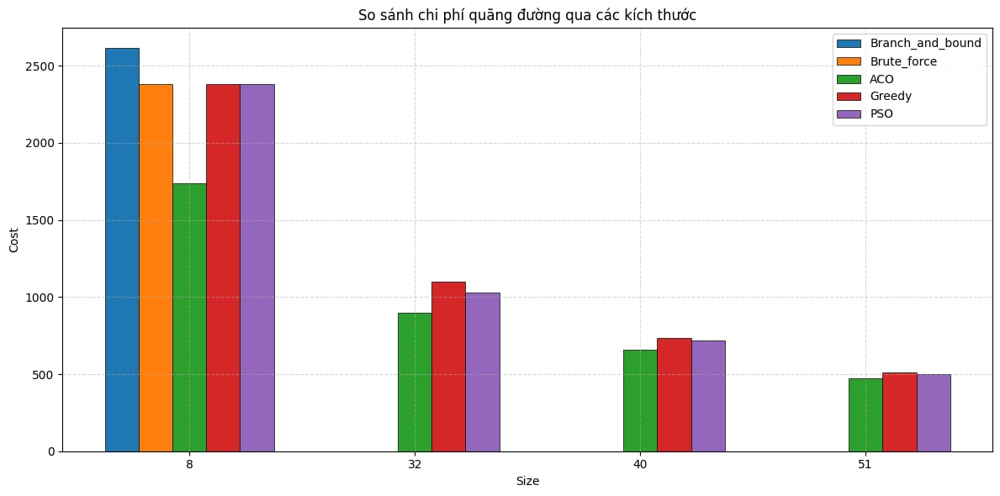

# So sánh hiệu quả các thuật toán tối ưu trong bài toán TSP (Traveling Salesman Problem)

## Tổng quan
Dự án được thực hiện trong khuôn khổ bài tập lớn môn Thiết kế và đánh giá thuật toán (MAT3504) - [Trường Đại học KHTN - Đại học Quốc Gia Hà Nội (HUS)], nhằm so sánh hiệu quả của các thuật toán metaheuristic, greedy và lớp thuật toán thử sai trong việc giải bài toán Traveling Salesman Problem (TSP). Các bước chính bao gồm:

- Tiền xử lý dữ liệu: Đọc và xử lý dữ liệu tọa độ thành phố từ các file `.data`, tính toán khoảng cách Euclidean giữa các thành phố.
- Thuật toán:
  - **Ant Colony Optimization (ACO)**: Tối ưu dựa trên hành vi của đàn kiến.
  - **Particle Swarm Optimization (PSO)**: Tối ưu dựa trên chuyển động của đàn hạt.
  - **Greedy**: Chọn điểm gần nhất làm bước tiếp theo.
  - **Branch and Bound**: Tìm lời giải chính xác với không gian trạng thái được cắt tỉa (dùng cho bài toán nhỏ, có thể mở rộng nếu bạn có thời gian 😄).
  - **Brute Force**: Kiểm tra tất cả các hoán vị có thể (dùng cho bài toán nhỏ).
- Đánh giá: So sánh hiệu suất các thuật toán dựa trên thời gian chạy, chất lượng lời giải (tổng khoảng cách), và độ ổn định trên các tập dữ liệu với số lượng thành phố khác nhau (từ 8 đến 1024).
- Kết quả trực quan: Biểu đồ đường đi tối ưu và biểu đồ cột so sánh hiệu suất các thuật toán.



## Thông tin thêm
**Giảng viên hướng dẫn:** [PGS.TS. Nguyễn Thị Hồng Minh](https://hus.vnu.edu.vn/gioi-thieu/can-bo/danh-sach-can-bo/nguyen-thi-hong-minh-1863.html), [CN. Trần Bá Tuấn](https://hus.vnu.edu.vn/gioi-thieu/can-bo/danh-sach-can-bo/tran-ba-tuan-3033.html).

**Sinh viên thực hiện:**
- Nguyễn Tiến Đạt        - 22000081
- Nguyễn Thành Trung     - 22001672
- Nguyễn Thị Ánh         - 22000070
- Nguyễn Khánh Đô        - 22000083

## Cấu trúc thư mục

```plain
TSP-Metaheuristic-Comparison/
├── src/                    # Mã nguồn
│   ├── algorithms/         # Các thuật toán
│   │   ├── aco.py
│   │   ├── pso.py
│   │   ├── greedy.py
│   │   ├── branch_and_bound.py
│   │   └── brute_force.py
│   ├── data/               # Dữ liệu đầu vào
│   │   ├── cities_8.data
│   │   ├── cities_16.data
│   │   ├── cities_20.data
│   │   ├── cities_22.data
│   │   ├── cities_32.data
│   │   ├── cities_40.data
│   │   ├── cities_48.data
│   │   ├── cities_51.data
│   │   ├── cities_64.data
│   │   ├── cities_256.data
│   │   ├── cities_322.data
│   │   └── cities_1024.data
│   ├── assets/             # Hình ảnh và biểu đồ được tạo
│   ├── util.py             # Hàm hỗ trợ xử lý dữ liệu
│   └── main.py             # File chính để chạy chương trình
├── docs/                   # Tài liệu nộp
│   ├── report.pdf          # Báo cáo
│   └── slides.pdf          # Slide trình bày
├── requirements.txt        # Danh sách thư viện cần thiết
├── LICENSE                 # Giấy phép
├── CONTRIBUTING.md         # Hướng dẫn đóng góp
├── .gitignore              # Tệp bỏ qua các file không cần thiết
└── README.md               # Hướng dẫn tổng quan
```

## Thiết lập

1. Clone repository về máy:
   ```bash
   git clone https://github.com/tdattm/TSP-Metaheuristic-Comparison.git
   ```
2. Tải các thư viện cần thiết:
   ```bash
   pip install -r requirements.txt
   ```

## Để chạy chương trình
Tất cả mã nguồn được tổ chức trong thư mục `src/`. Để chạy chương trình:
```bash
python src/main.py
```
- File `main.py` sẽ thực hiện các thuật toán trên các tập dữ liệu trong thư mục `data/` và lưu kết quả (biểu đồ, hình ảnh đường đi) vào thư mục `assets/`.
- Xem chi tiết cách chạy và các tham số trong file `main.py`.

## Kết quả
- Biểu đồ đường đi tối ưu và so sánh hiệu suất: `src/assets/`
- Kết quả chi tiết (thời gian chạy, tổng khoảng cách) được in ra trong quá trình chạy `main.py`.

## Báo cáo và slide trình bày
- Báo cáo: `docs/report.pdf`
- Slides: `docs/slides.pdf`

## Liên hệ
Nếu bạn có câu hỏi hoặc muốn đóng góp cho dự án, vui lòng xem hướng dẫn chi tiết ở [CONTRIBUTING.md](CONTRIBUTING.md).

📧 [Email: nguyentiendat1_t67@hus.edu.vn](mailto:nguyentiendat1_t67@hus.edu.vn)